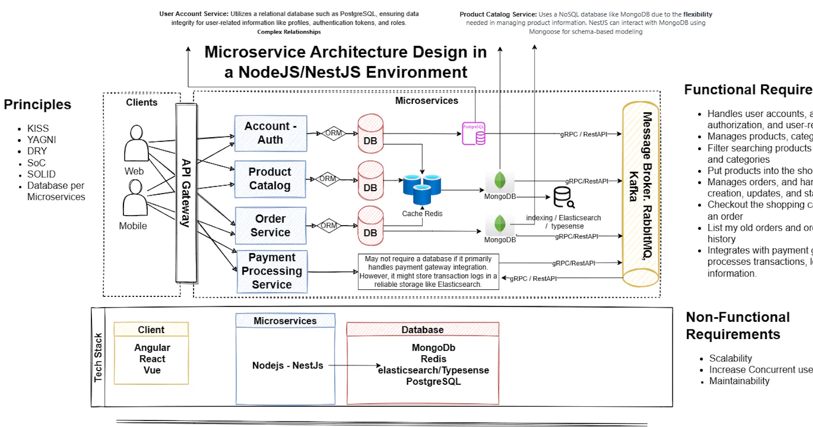

## Description

framework TypeScript starter repository.

## Installation

```bash
$ yarn install
```

## Running the app

```bash
# development
$ yarn run start

# watch mode
$ yarn run start:dev

# production mode
$ yarn run start:prod
```

---

#### Microservice Architecture Design in a NodeJS/NestJS Environment:

**Scenario:** You are tasked with designing a microservice architecture for an online retail system. This system should manage various aspects like product catalog, user accounts, orders, and payment processing.



### **Microservices:**

#### 1\. **Product Catalog Service**

- **Database:** MongoDB or a similar NoSQL database for flexible schema and quick retrieval of product information.
- **Functionality:** Manages products, categories, inventory.

#### 2\. **User Account Service**

- **Database:** PostgreSQL or MySQL for relational data like user profiles, authentication, and authorization.
- **Functionality:** Handles user accounts, authentication, authorization, and user-related data.

#### 3\. **Order Service**

- **Database:** MongoDB or a SQL database, depending on the complexity of order-related data and need for transactional integrity.
- **Functionality:** Manages orders, handles order creation, updates, and status tracking.

#### 4\. **Payment Processing Service**

- **Database:** May not require a database if it primarily handles payment gateway integration. However, it might store transaction logs in a reliable storage like Elasticsearch.
- **Functionality:** Integrates with payment gateways, processes transactions, logs payment information.

### **Communication between Microservices:**

1. **RESTful APIs or GraphQL:** Each microservice exposes an API for interaction. NestJS provides excellent tools for building RESTful APIs or GraphQL endpoints, ensuring standardized communication.
2. **Message Broker (Optional):** Implement a message broker like RabbitMQ or Kafka for asynchronous communication between services. This ensures loose coupling and better scalability.

### **Security:**

1. **JWT Tokens:** Implement JWT (JSON Web Tokens) for authentication and authorization across services. NestJS provides robust authentication mechanisms.
2. **HTTPS:** Ensure secure communication between microservices using HTTPS to prevent data breaches.

---

---

---

### **Database Choice:**

1. **Database Selection:** Consider using a database that suits your application's read-and-write patterns. For high-traffic applications, a combination of databases might be beneficial.

   - **Relational Databases (e.g., PostgreSQL, MySQL):** Suitable for complex relationships and transactions.
   - **NoSQL Databases (e.g., MongoDB, Cassandra):** Scalable and efficient for handling large volumes of data.

2. **Caching Strategies:** Implement a caching layer (e.g., Redis) between your application and the database to cache frequently accessed data and reduce database load. Utilize caching at multiple levels (query caching, result caching) for performance improvement.

### **High Concurrency and Load Handling:**

1. **Load Balancing:** Employ load balancers (e.g., NGINX, HAProxy) to distribute incoming traffic across multiple instances of your NestJS application to handle high concurrency.
2. **Scalability:** Utilize horizontal scaling by deploying multiple instances of your NestJS application behind a load balancer. Consider containerization (Docker, Kubernetes) to manage and scale instances dynamically.

### **Optimization Techniques for NestJS:**

1. **Middleware Optimization:** Review and optimize middleware usage to reduce unnecessary processing. Remove or optimize middleware that isn't essential for every request.
2. **Cache Middleware:** Integrate caching middleware to cache responses for static or less frequently changing data, reducing the load on your application.
3. **Guard Optimization:** Optimize authentication and authorization guards to minimize overhead. Cache user sessions or tokens to avoid frequent lookups.

### **Deployment Considerations:**

1. **Cloud Services:** Consider deploying on cloud platforms like AWS, Azure, or Google Cloud Platform. Utilize their scaling capabilities, managed databases, and other services like AWS RDS or Azure Cosmos DB.
2. **Containerization with Docker:** Containerize your NestJS application using Docker to ensure consistent deployment across environments and easy scalability.
3. **CI/CD Pipelines:** Implement CI/CD pipelines (e.g., Jenkins, GitLab CI/CD, GitHub Actions) to automate testing, building, and deploying your application.

### **Libraries and Tools for Performance and Maintainability:**

1. **PM2:** Use PM2 process manager for NodeJS applications to manage and monitor multiple instances, enable clustering, and auto-restart on failure.
2. **Helmet:** Employ the Helmet middleware to enhance security by setting HTTP headers.
3. **Winston/Morgan:** Use Winston for logging and Morgan for request logging, both providing configurable logging options.
4. **TypeORM/Sequelize/Mongoose:** Depending on the database choice, utilize these ORMs for efficient database interactions and query optimizations.
5. **NestJS Microservices:** Consider breaking down specific functionalities into microservices for better scalability and isolation.
6. **Profiler Tools:** Utilize Node.js profiler tools (e.g., Clinic.js, Node.js Diagnostics) to identify performance bottlenecks and optimize code.

---

---

# **Order Creation API Documentation**

### **Endpoint**

- **URL**: [`http://localhost:3000/order/create`](http://localhost:3000/order/create)
- **Method**: `POST`

### **Request Body**

- **Format**: JSON
- **Fields**:
  - `user_id` (string)
  - `orderId` (string)
  - `products` (array of strings)
  - `payment` (boolean)

#### Example Request Body

```javascript
{
  "user_id": "dsfgjrgj123",
  "orderId": "23fsdfr%$243",
  "products": ["234234","2352df3", "dgsd@$@$234"],
  "payment": true
}
```

### **Error Handling**

- **Response Code**: `400 Bad Request`
- **Response Body**:

```javascript
{
  "message": [
    "user_id must be a string",
    "orderId must be a string",
    "products must be an array",
    "payment must be a boolean value"
  ],
  "error": "Bad Request",
  "statusCode": 400
}
```

### **Successful Response**

- **Response Format**: JSON Array
- **Example Response**:

```javascript
[
  {
    user_id: 'dsfgjrgj123',
    orderId: '23fsdfr%$243',
    products: ['234234', '2352df3', 'dgsd@$@$234'],
    payment: true,
  },
  {
    user_id: 'dsfgjrgj123',
    orderId: '23fsdfr%$243',
    products: ['234234', '2352df3', 'dgsd@$@$234'],
    payment: true,
  },
];
```

---

This condensed version highlights the essential details for the API endpoint without extensive elaboration. Adjustments can be made based on your specific documentation needs.
